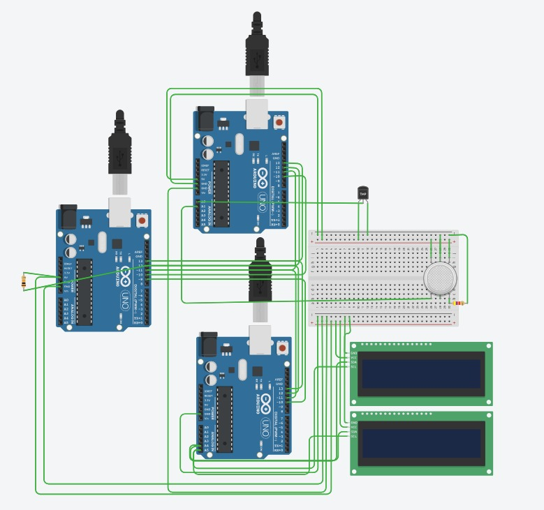
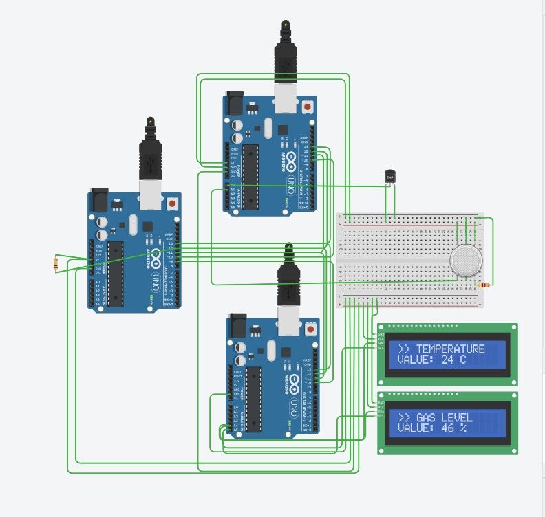

# Real-Time Environmental Monitoring System (SPI Master/Slave)

**Result:** Individual project, graded Excellent — first student to submit in the section
**Course:** Systems Engineering for Real-time Systems, Al-Nahrain University (2026)

A real-time environmental monitoring system built across 3 Arduino boards
communicating over a software-bitbanged SPI bus in a Master/Slave
architecture.

## Screenshots

## Architecture

- **`master.ino`** — Polls Slave 1 for sensor readings and forwards them to
  Slave 2 for display. Also accepts serial commands (`1`, `2`, `3`) to switch
  display mode.
- **`slave1_sensors.ino`** — Reads a TMP36 temperature sensor and a gas
  sensor, responds to Master polling requests.
- **`slave2_display.ino`** — Drives two I2C LCD displays showing temperature
  and gas-level readings, switches layout based on the active display mode.

## How it works

The Master continuously polls Slave 1 for temperature and gas values over a
hand-implemented (bit-banged, not hardware) SPI protocol, then relays the
latest reading to Slave 2 for display — alternating which value is pushed
each cycle. A simple command protocol (byte 200 = mode-switch command,
101/102 = temperature/gas value packets) lets the Master control what each
slave does without a shared clock/library dependency, since chip-select
lines distinguish which device is being addressed at any given moment.

## Simulation

You can view the full circuit wiring and run the real-time communication simulation directly in your browser:
[Run the Tinkercad Simulation](https://www.tinkercad.com/things/6tU7V3GViLh-real-time-environmental-monitoring-system-spi-masterslave)

## Hardware
- 3x Arduino Uno
- TMP36 analog temperature sensor
- Analog gas/smoke sensor
- 2x I2C LCD displays (16x2), addresses 0x20 and 0x27

## Libraries required
`LiquidCrystal_I2C` (for the display slave only)
